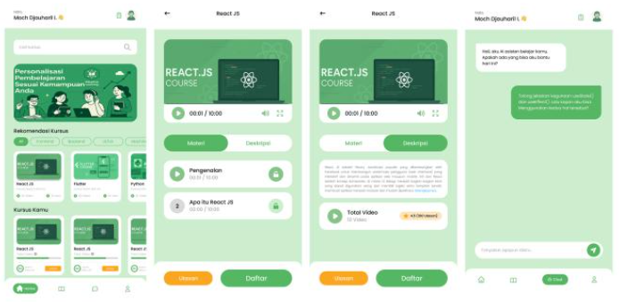
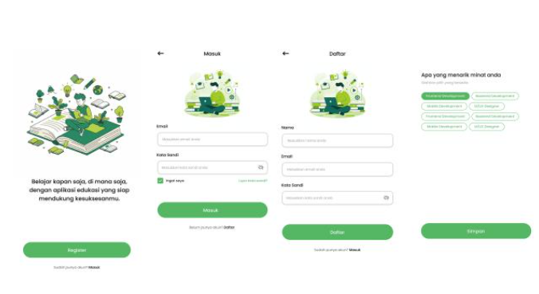
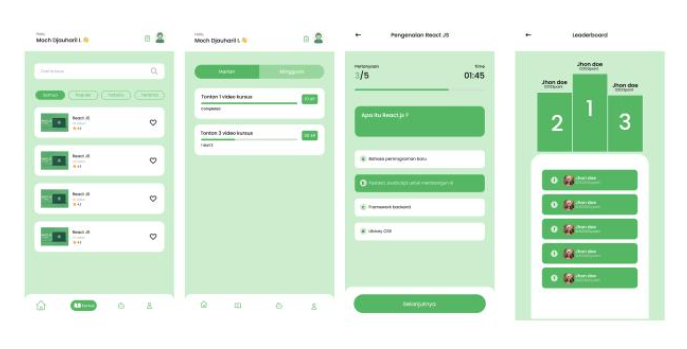

# NgodingIn

NgodingIn adalah aplikasi mobile berbasis Flutter yang dirancang untuk membantu pengguna belajar pemrograman secara terstruktur dan interaktif langsung dari smartphone. Aplikasi ini menyediakan kursus video, quiz, leaderboard, quest harian/mingguan, serta fitur AI chat berbasis Gemini API.

---

## Tampilan Aplikasi

<p align="center">
  
</p>

<p align="center">
  
</p>

<p align="center">
  
</p>

---

## Fitur

- Autentikasi pengguna (login, register, verifikasi email, lupa kata sandi)
- Pemilihan preferensi topik untuk personalisasi kursus
- Daftar kursus pemrograman dengan sistem enroll dan favorit
- Video pembelajaran dengan progress tracking
- Quiz interaktif per materi kursus
- Quest harian dan mingguan
- Leaderboard antar pengguna
- AI chat berbasis Gemini API

---

## Teknologi

| Komponen | Detail |
|---|---|
| Framework | Flutter (Dart SDK ^3.9.0) |
| Platform | Android & iOS |
| State Management | Provider |
| HTTP Client | http ^1.0.0 |
| Video Player | Chewie, YouTube Player IFrame |
| AI Chat | Google Generative AI (Gemini) |
| Storage Lokal | Shared Preferences |
| Font & Ikon | Google Fonts, Font Awesome, Lucide Icons |
| IDE | Android Studio / VS Code |

---

## Struktur Proyek

```
Ngodingin/
├── android/                        # Konfigurasi native Android
├── ios/                            # Konfigurasi native iOS
├── assets/
│   ├── icons/                      # Ikon aplikasi
│   └── images/                     # Aset gambar
├── lib/
│   ├── main.dart                   # Entry point aplikasi
│   ├── constants/                  # Konstanta aplikasi (warna, string, dll.)
│   ├── models/                     # Model data
│   ├── providers/                  # State management (Provider)
│   ├── shared/                     # Komponen dan widget yang digunakan ulang
│   ├── utils/                      # Helper dan utilitas
│   └── features/
│       ├── splash/                 # Splash screen
│       ├── landing/                # Halaman landing
│       ├── auth/                   # Login & Register
│       ├── email-verification/     # Verifikasi email
│       ├── forgot-password/        # Lupa kata sandi
│       ├── chose_prefrences/       # Pemilihan preferensi topik
│       ├── home/                   # Dashboard utama
│       ├── course/                 # Daftar dan detail kursus
│       ├── quiz/                   # Halaman quiz
│       ├── mission/                # Quest harian & mingguan
│       ├── leaderboard/            # Papan peringkat
│       └── widgets/                # Widget fitur-spesifik
├── pubspec.yaml                    # Konfigurasi dependensi Flutter
└── README.md
```

---

## Persyaratan

Pastikan perangkat pengembangan telah memiliki:

- [Flutter SDK](https://flutter.dev/docs/get-started/install) versi 3.x atau lebih baru (Dart SDK ^3.9.0)
- Android Studio atau VS Code dengan ekstensi Flutter dan Dart
- Android SDK (API level 21 ke atas) atau Xcode untuk iOS
- Perangkat fisik atau emulator Android/iOS aktif

---

## Instalasi

### 1. Clone Repository

```bash
git clone https://github.com/yowxy/Ngodingin.git
cd Ngodingin
```

### 2. Verifikasi Flutter

```bash
flutter doctor
```

Pastikan tidak ada error kritis sebelum melanjutkan.

### 3. Install Dependensi

```bash
flutter pub get
```

### 4. Konfigurasi API Key (Gemini)

Proyek ini menggunakan Google Generative AI (Gemini). Pastikan API key sudah dikonfigurasi pada file yang sesuai di `lib/constants/` atau `lib/utils/` sebelum menjalankan aplikasi.

### 5. Jalankan Aplikasi

```bash
# Lihat daftar device yang tersedia
flutter devices

# Jalankan aplikasi
flutter run

# Atau jalankan pada device tertentu
flutter run -d <device-id>
```

### 6. Build APK (Opsional)

```bash
flutter build apk --release
```

File APK tersedia di: `build/app/outputs/flutter-apk/app-release.apk`

---

## Menjalankan di Android Studio

1. Buka Android Studio, pilih **Open** dan arahkan ke folder proyek.
2. Tunggu proses indexing selesai.
3. Pilih device target dari dropdown di toolbar.
4. Klik **Run** atau tekan `Shift + F10`.

## Menjalankan di VS Code

1. Buka folder proyek di VS Code.
2. Jalankan `flutter pub get` di terminal.
3. Tekan `F5` atau buka **Run > Start Debugging**.
4. Pilih device target yang tersedia.

---

## Catatan

Untuk menampilkan screenshot pada README ini, simpan file gambar ke folder `assets/screenshots/` dengan nama `screen1.png`, `screen2.png`, dan `screen3.png`.

---

Dikembangkan sebagai proyek kompetisi Hology.